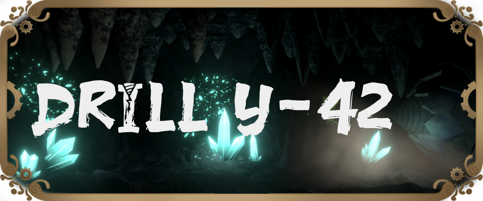

[Download on itch](https://s4g.itch.io/drill) -
[Project Page](https://mondanzo.de/#drilly42)

# About

Step into Akai’s world of calm exploration, discovering a cozy gaming adventure! Cozy Tales is more than just a game; it's a comforting escape into a serene and charming world. Here, players are invited to immerse themselves in a peaceful adventure, turning maps into stories and guiding future adventurers.

## Key Informations:
Engine: Unity 2022.3.1f1

Team Size: 9 people

Platform: PC

Genre: Endless Runner with Resource Management

Participation Duration: 10 weeks

Release: 16.08.2023

Number of Players: Single Player

# Role in the team

- **Lead Engineer**
- Procedural Generation
- Tool Programming
- UI Programmer
- Profiling

# Tasks in the project

- Profiling, Debugging and Performance Optimisation
- [Tutorial System](Assets/Scripts/Runtime/Tutorial)
- [Cave Generation](Assets/Scripts/Runtime/Cave Generation)
- [Global Event System](Assets/Scripts/Runtime/Events)
- UI Menu Programming
- [Subtitle System](Assets/Scripts/Runtime/Story/Subtitles)
- Tool Programming
  - [Perforce Ignore Plugin](Assets/Plugins/Perforce+)
  - [Subtitle Editor](Assets/Scripts/Editor/Subtitles)
- FMOD Integration
- Smaller Gimmicks
  - [Screenshake](Assets/Scripts/Runtime/CameraShake)

# Learnings taken

- Generation needs a lot of planning.
  - Do not rely on physics engine for generation.
- Really rely on either FMOD or Unity Sound, try not to mix them.
- First work experience with Perforce.
- Generation is very intensive and should either be hidden behind loading or very quickly very fast very parallel.

# Screenshots

